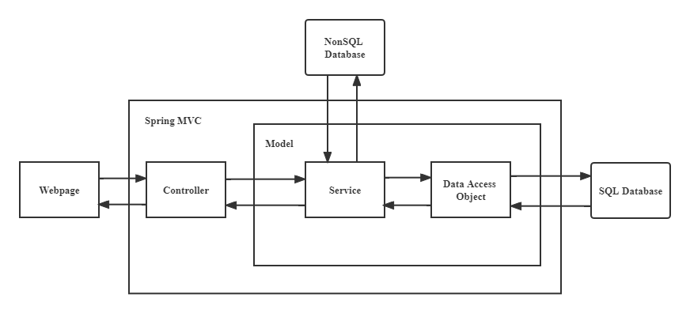
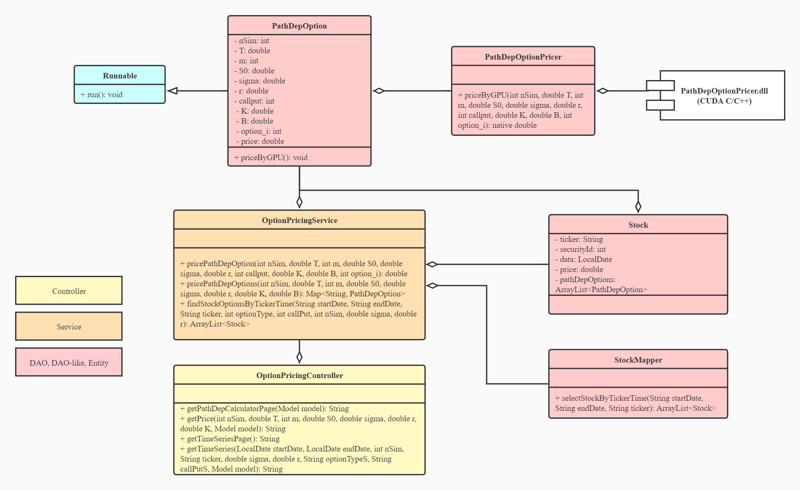

<!-- title: Project Report & Documentation -->

In this project, I am going to implement instruments to compute prices for path-dependent options and accelerate the whole process using GPU parallel computing. For the ease to extend the functionalities of this instrument, I design the code in terms of how Monte Carlo model interacts with specific options, as well as how GPU codes can get involved into Monte Carlo model.

# 1. Theories

Stock price follows the process: $S(t)=S(0)\ e^{(r-\sigma^2/2)t+\sigma\ W_Q\ (t)}$, which can be further written as: $S(t_k)=S(t_{k-1})e^{\left(r-\frac{\sigma^2}{2}\right)(t_k-t_{k-1})+\sigma\sqrt{t_k-t_{k-1}}Z_k}$, where $Z_1$,$\ \ldots$,$\ Z_m$ are independent and identically distributed random variables with distribution N(0,1).

A path-dependent option can be summarized as such a type of options whose payoff depends on all the prices of its underlying assets from now to its expiration. Some typical representatives are Arithmetic Asian options, Russian options, Lookback options, etc.

For a path-dependent option with expiration as T, its path toward expiration is: $(S\left(t_1\right),\ \ldots,\ S(t_m))$, where $t_k=\left(\frac{k}{m}\right)T,\ k=1,\ \ldots,\ m$. So, the price of this option at expiration is: $H\left(T\right)=h(S\left(t_1\right),\ \ldots,\ S(t_m))$. Then the price of this option now can be calculated discounted under the risk-neutral probability: $H\left(0\right)=e^{-rT}E_Q(H(T))$. 

The expectation stated above is very easy to compute using Monte Carlo, where the foundation is to simulate possible independent paths: $({\hat{S}(t}_1),\ \ldots,\ {\hat{S}(t}_m))$. Each sample path is defined by: 

$\hat{S}\left(t_1\right)=S\left(0\right)e^{\left(r-\frac{\sigma^2}{2}\right)t_1+\sigma\sqrt{t_1}{\hat{Z}}_1}$, 

$\hat{S}\left(t_k\right)=\hat{S}\left(t_{k-1}\right)e^{\left(r-\frac{\sigma^2}{2}\right)\left(t_k-t_{k-1}\right)+\sigma\sqrt{t_k-t_{k-1}}{\hat{Z}}_k},\ k=2,\ldots,m$

By the law of large numbers: 

$E_Q(h({S(t}_1),\ \ldots,\ {S(t}_m)))=\lim_{N\rightarrow\infty}{\frac{1}{N}\sum_{i=1}^{N}{h({{\hat{S}}^i(t}_1),\ \ldots,\ {{\hat{S}}^i(t}_m))}}$

So, the final solution is: 

$H\left(0\right)\approx{\hat{H}}_N\left(0\right)=e^{-rT}\frac{1}{N}\sum_{i=1}^{N}{h({{\hat{S}}^i(t}_1),\ \ldots,\ {{\hat{S}}^i(t}_m))}$

In this model, while all path-dependent, each option can have different payoff function, which should be specified by the user along with other parameters. For instance, the payoff function for Arithmetic Asian call options is:

$h^{arithmAsiancall}\left(S_1,\ \ldots,S_m\right)={(\frac{1}{m}\sum_{k=1}^{m}{S_i-K})}^+$ 

Considering all these common features shared by Monte Carlo model in simulating path-dependent options, and that all those differences in payoffs among different path-dependent options, I design the following framework to implement codes so that my instrument will be of a good efficiency and in ease for extension.

# 2. Project Design

In this project, I am going to build applications for pricing path-dependent options accelerated by GPU computing. In implementation, I refer to multi-language programming combining C++, CUDA C/C++ and Java.

* CUDA C/C++ is used for coordinating with GPU. The basic idea is use CUDA C/C++ to do every Monte Carlo simulation in parallel. This module finally outputs one wrapper function that wraps all CUDA C/C++ and C++ codes. This function takes in several parameters for determining one path-dependent option, pricing it with Monte Carlo on GPU and finally output the price. We output this function as `.dll`, so that it can be easily used. Alternatively, we can also directly output this into `.exe`, to generate a console for debug use.

* Java is used for building applications on server, calling CUDA C/C++ function to interact with GPU. The development of such applications is based on Java Spring framework. I develop the following:

    * A path-dependent option price calculator. Once you key in every parameter path-dependent options should have on the webpage, Java calls GPU functions to calculate prices for all possible path-dependent options and return the results on the webpage.

    * A path-dependent option data pipeline. Once you key in every parameter for a stock and determine time period on the webpage, Java calls generated options for this stock at each day with different parameters and then return them as table on the webpage.

The following parts are going to discuss the specific implementations.

## 2.1 Implement GPU computing module with CUDA C/C++
> **Disclaimer**: The documentation of CUDA C/C++ has explicitly stated that `__global__` functions are not allowed to be used as class member function. This obstructs OOP design. I have to implement the whole process as a procedure rather than objects.

The implementation for pricing one path-dependent option is:

* Set up CUDA device, allocate host and device arrays, set up random states
* Allocate GPU threads to compute in parallel, each thread does one simulation of Monte Carlo:
  * Generate a random sample path
  * Calculate the payoff at time $T$ for this path,  ${\hat{H}}_i(T)$
  * Write ${\hat{H}}_i(T)$ into device arrays.
* Average payoffs ${\hat{H}}_i(T)$ of all simulations, discount them to the current time, then return this result as option price
* Clean up memories on host and device

The directory of CUDA C/C++ codes is as below:

```
cpp
│   kernels.cu   
│   kernels.cuh
|   PathDepOptionPricer.cu
|   PathDepOptionPricer.cuh
|   price_one_option.cu
|   price_one_option.cuh
    
```

Here, `kernels.cu` defines all necessary `__global__` and `__device__` functions that will be used to call GPU device and instruct the device how to calculate. `price_one_option.cu` defines one wrapper function. THis wrapper function wraps all CUDA C/C++ and C++ codes. This function takes in several parameters for determining one path-dependent option, pricing it with Monte Carlo on GPU and finally output the price.

We can use this wrapper function by:

* Exporting the wrapper function to `.dll` file so that this function can be shared with other C++ codes or even other languages. In this project, I build `PathDepOptionPricer.cuh` to export `PathDepOptionPricer.dll` file that can be called by Java
  
* Creating and calling the main function in a `main.cu`, which exports a `.exe` file for running
  
  ```cpp
  /*Sample code for main.cu to export .exe*/
  #include "price_one_option.cuh"

  using namespace std;
  using namespace fre;

  int main()
  {

      int nSim;

      // input for option pricing
      double T;
      int m;
      double S0;
      double sigma;
      double r;
      int callput; // call : 1, put : 2
      string sType;
      double K;
      double B;
      int option_i;
      option_type option;

      cout << "Enter parameter below." << endl;

      cout << "Option type [1:barrier/2:lookbcak/3:Asian]: ";
      cin >> option_i;
      option = static_cast<option_type>(option_i);

      switch (option) {
      case 1:
          cout << "You are pricing barrier option." << endl;
          break;
      case lookback:
          cout << "Your are pricing lookback option." << endl;
          break;
      case asian:
          cout << "Your are pricing Asian option." << endl;
          break;
      }

      cout << "Enter expration T in year: ";
      cin >> T;
      cout << endl;

      cout << "Enter time step m: ";
      cin >> m;
      cout << endl;

      cout << "Enter start stock price S0: ";
      cin >> S0;
      cout << endl;

      cout << "Enter volatility of stock price sigma: ";
      cin >> sigma;
      cout << endl;

      cout << "Enter annual interest rate r: ";
      cin >> r;
      cout << endl;

      while (sType != "call" && sType != "put") {
          cout << "Enter call put type [call/put]: ";
          cin >> sType;
          cout << endl;
      }

      cout << "Enter strike price K: ";
      cin >> K;
      cout << endl;

      if (option == barrier) {
          cout << "Enter barrier level B: ";
          cin >> B;
          while (sType == "call" && B <= K) {
              cout << "Enter barrier level B, B > K: ";
              cin >> B;
          }
          while (sType == "put" && B >= K) {
              cout << "Enter barrier level B, B < K: ";
              cin >> B;
          }
          cout << endl;
      }
      else {
          B = 0.0;
      }

      cout << "Enter number of simulations: ";
      cin >> nSim;
      cout << endl;

      if (sType == "call") callput = 1;
      if (sType == "put") callput = 2;

      double Price = 0.0;
      Price = price_one_option_function(nSim, T, m, S0, sigma, r, callput, K, B, option_i);
      cout << "Option price is: " << Price << endl;

      return 0;

  }
  ```

## 2.2 Build applications with Java

In previous section, I have implemented codes for pricing one path-dependent option. Now, I am going to extend this to some real applications that can be used. I also bench the applications against some we already have in real world.

### 2.2.1 Use Java Native Interface to call CUDA C/C++ function from Java

The practice to use Java access CUDA C/C++ is non-trivial. This process has been facilitated by Java Native Interface (JNI). In my scenario, I take the following actions:

* In Java, I define a class `PathDepOptionPricer` to handle the interaction with GPU codes. I instruct Java to load the `PathDepOptionPricer.dll` from a certain directory. After the load at runtime, Java link the dll function with its `priceByGPU()` method
  
  ```java
  // This class locates at PathDepOptionPricer.java
  public class PathDepOptionPricer {

    static {
        System.load("${dirOfDll}/PathDepOptionPricer.dll");
    }

    public native double priceByGPU(int nSim, double T, int m, double S0, double sigma, double r, int callput, double K, double B, int option_i);

    }
  ```

* I then go to terminal, compile this file. Then Java generates a JNI header file `${packageName}_PathDepOptionPricer.h` for the public native method `priceByGPU()`.
  ```sh 
  javac -h ${destDirectory} ${dirOfPathDepOptionPricer.java}
  ```

  > **Warning**: Previous practice would refer to command `javah` to generate such head files. This command has been excluded after JDK 8.0.

  The header file looks like this:
  ```cpp
  /* DO NOT EDIT THIS FILE - it is machine generated */
  #include <jni.h>
  /* Header for class com_ky2072_fre_entity_PathDepOptionPricer */

  #ifndef _Included_com_ky2072_fre_entity_PathDepOptionPricer
  #define _Included_com_ky2072_fre_entity_PathDepOptionPricer
  #ifdef __cplusplus
  extern "C" {
  #endif
  /*
   * Class:     com_ky2072_fre_entity_PathDepOptionPricer
   * Method:    priceByGPU
   * Signature: (IDIDDDIDDI)D
   */
  JNIEXPORT jdouble JNICALL Java_com_ky2072_fre_entity_PathDepOptionPricer_priceByGPU
  (JNIEnv *, jobject, jint, jdouble, jint, jdouble, jdouble, jdouble, jint, jdouble, jdouble, jint);

  #ifdef __cplusplus
  }
  #endif
  #endif
  ```

* Copy `${packageName}_PathDepOptionPricer.h` to the CUDA C/C++ codes' directory, create a new file `PathDepOptionPricer.cpp` (I rename the header file to `PathDepOptionPricer.h`), define the function `Java_com_ky2072_fre_entity_PathDepOptionPricer_priceByGPU()` by calling wrap function in `price_one_option.cu`.

* Build the CUDA C/C++ codes and export as `PathDepOptionPricer.dll`. Before the build, remember to instruct IDE the location of `./include` and `./include/win32` directories in the JDK directory

* Copy `PathDepOptionPricer.dll` to any directory Java can find, but should be consistent with the directory declared in the `load()` function of class `PathDepOptionPricer`

* Now the link between CUDA C/C++ and Java has been established. Once we create   `PathDepOptionPricer` objects, Java load the CUDA C/C++ functions in `PathDepOptionPricer.dll` and link it with method `priceByGPU()`

### 2.2.2 Build web applications with Java

I use the industrial framework Java Spring to build my web applications for path-dependent option pricing.

Please refer to the pictures below to get an overview of MVC framework. Basically, we have:

* `Controller`: It calculates model and forward the model to template. Template use the model to generate web pages and return response to users

* `Model`: Consists of Service and Data Access Objects. They are used to calculate and return data

* `Model` can get data from database, or it can get data from a certain object that generates data




Given this framework, I develop my classes as below.



**Data Access Objects**

According to the MVC framework, I first develop the Data Access Objects and their supporting entity objects.

* `PathDepOptionPricer`: the wrapper class of external CUDA C/C++ function to price one path-dependent option

* `PathDepOption`: the class to describe a path-dependent option. Its `priceByGPU()` method creates object of `PathDepOptionPricer` and calls functions of CUDA C/C++ to price the current object of `PathDepOption` and update the `price` attribute.

* `Stock`: the class to describe a stock at a certain date. It contains a list of `PathDepOption` objects, since a stock can generate multiple different options in nature

* `StockMapper`: the interface to map between objects of `Stock` and real-world database. In this project, I use Java to connect a SQL Server database `IVY` through `MyBatis` framework and `mssql-jdbc`. Once the method `selectStockByTickerTime()` is called, the mapper queries data from `IVY` database in terms of `ticker` and `date`. It then gets a list of stock data from database. It automatically converts the list of stock data into corespondent list of `Stock` objects
  > **Reminder**: The `IVY` database is purchased by NYU Tandon FRE department. In order to access the database and thus this functionality of my application, you should connect to NYU's network through VPN first.

All of these classes and their objects are designed to generate data or retrieve data from a database. Thus they resemble the definition of Data Access Object provided by Spring MVC.

**Service**

I then develop the `Service` objects. Here only one `Service` class is implemented: `OptionPricingService`. Its methods deal with data in different ways and return different data to Controller for different functionalities of the application

* Method `pricePathDepOption()` is for test use only. It directly calls a `PathDepOptionPricer` and return its pricing result for one option given parameters

* Method `pricePathDepOptions()` prices all path-dependent options for given parameters. It first creates objects for all path-dependent options. It then allocates CPU threads, where each thread in parallel calls one option's `priceByGPU()` method to update their prices. It finally returns a map for prices of all these options

* Method `findStockOptionsByTickerTime()` generates path-dependent options for real-world stocks in given periods and price these options accordingly. To be specific, we first query and retrieve a list of `Stock` objects according to user's parameters. 
  
  For each stock:
  * Generate parameter lists `tChoices` for expiration time `T`
  * Generate parameter lists `kChoices` for strike `K`, which is floating up and down from the current stock price
  * Allocate a CPU thread pool whose size is the same as number of parameter sets
  * For each parameter set defined by `tChoices` and `kChoices`, do the following in parallel:
    * Use one thread from the thread pool
    * Generate one path-dependent option based on parameters
    * Add this option into the current `Stock` object's list for its options
    * Use the current thread to call the current option's `priceByGPU()` to update its price
  
  Finally, this returns a list of `Stock` objects, where each object has a list of generated path-dependent options with calculated option price

**Controller**

I finally develop `Controller` object for different functionalities of my application: `OptionPricingController`.

* The first functionality is a path-dependent option price calculator. User type in given parameters for path-dependent options, then the server calculates the price for all types of options.
  
  The methods for this function is:
  
  * Method `getPathDepCalculatorPage()` maps to the path `/path-dependent/calculator`. It simply returns a webpage with a form of parameters for user to key in. See the template for the webpage [here](./java/fre/src/main/resources/templates/path-dependent-calculator.html). Once user click the button `Submit`, a `POST` request is sent to `/path-dependent/calculator/exec`, which maps to another method below
  
  * Method `getPrice()` maps to the path `/path-dependent/calculator/exec`. Once called, it calls method `pricePathDepOptions()` of a `OptionPricingService` object. It adds data into a `Model` object. The `Model` object then renders the template to return a view of final result shown to the user
 
* The second functionality is a data pipeline to query data from the real-world database. User type in given parameters for a stock at a certain period, then the server generates multiple options for this stock in this period.
  
  The methods for this function is:
  
  * Method `getTimeSeriesPage()` maps to the path `/path-dependent/time-series-data`. It simply returns a webpage with a form of parameters for user to key in. See the template for the webpage [here](./java/fre/src/main/resources/templates/path-dependent-time-series.html). Once user click the button `Submit`, a `POST` request is sent to `/path-dependent/time-series-data/exec`, which maps to another method below
  
  * Method `getTimeSeries()` maps to the path `/path-dependent/time-series-data/exec`. Once called, it calls method `findStockOptionsByTickerTime()` of a `OptionPricingService` object. It adds data into a `Model` object. The `Model` object then renders the template to return a view of final result shown to the user

# 3. Project Demo

In this section, I present how user interact with the webpage and then get the results. I lead a walk through of the two functionalities of my web application.

# 3.1 Path-dependent option pricing calculator

Once user keys in every parameter path-dependent options should have on the webpage, Java calls GPU functions to calculate prices for all possible path-dependent options and return the results on the webpage.

This functionality is benchmarked against the [option pricing calculator](http://www.math.columbia.edu/~smirnov/options13.html) published by Columbia University.

To use this functionality:
* Compile and run the whole project
* Go to the path `http://localhost:53777/fre/path-dependent/calculator` to connect with server
* Type in all the parameters required
* Press `Calculate` button
* Get the results within seconds

See the video below for an overview of process and results.

<video src="./img/calculator.webm" width="1000" height="600"  controls></video>

# 3.2 Path-dependent option data pipeline

Once the user keys in every parameter for a stock and determine time period on the webpage, Java generates options for this stock at each day with different parameters and then return them as table on the webpage.

This functionality is benchmarked against the `IVY` database itself to produce table for pricing of different option contracts for all stocks through their history. Here the `IVY` produces American option and they are real contracts in the world. Unfortunately I cannot find a database for real path-dependent options at this time so I have to generate them using different parameters to mimic what this framework can do.

To use this functionality:
* Compile and run the whole project
* **Must connect to NYU VPN**
* Go to the path `http://localhost:53777/fre/path-dependent/time-series-data` to connect with server
* Type in all the parameters required
* Press `Calculate` button
* Get the results within seconds

See the video below for an overview of process and results.

Be advised, it takes several extra seconds here because we have files to write on the disk. If disable the write file to disk function, then it should be much faster.

<video src="./img/data-pipeline.webm" width="1000" height="600"  controls></video>

# 3.3 Performance analysis

As we can conclude from the demo here, the performance is great in terms of calculation's timing. For instance, the calculation for 4 pricing, each pricing with 30000 simulations takes only 0.30s. As for precision, the result is very similar to public resources of Monte Carlo pricing path dependent options, with percentage difference less than 0.5%.

# 4. Deployment

At this point, I don't have enough time to transfer all these codes from my local machine to NYU HPC server. Even I manage to do that I am not sure whether I can obtain a domain for the public to access. Yet in theory all these codes work very well for any Windows machine with GPU. All you need is a JDK and CUDA runtime environment.

All you need to do is:

* Use IntelliJ IDEA to open the directory `fre` under the directory `java`

* Make sure every property in the `application.properties` matches your true environment:

  * If `server.port=53777` is not a good port for you, then change it to an available one

  * Configure `fre.context-path` and `FreUtils.getFreContext()` to your own path containing the directory `fre`

  * If during runtime there is a `java.lang.unsatisfiedlinkerror` when connecting Java class with `.dll` functions, try to regenerate the header file and redefine the CUDA C/C++ functions as guided in section 2.2.1.

I admit that after trying the procedures above, your local machine may still fail to run Java codes. After all, environments in computers differ from each other significantly. But I don't think it is very important that this application has to be fit into everyone's local machine. In fact it only needs to be run in a server! So please contact me directly if you need a live demo and I am happy to do that!